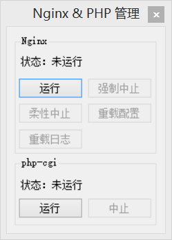

一、功能简介
=============

实现了以下功能：
- 控制 Nginx.exe 的启动、quit、stop、reload 与 reopen。
- 控制 php-cgi.exe 的启动与中止。
- 可以通过修改配置文件指定 Nginx.exe 与 php-cgi.exe 的目录。

效果图：


二、使用方法
=============

下载后，请在主程序所在目录下新建一个空白文本文档，将其文件名设置为：npm.xml。
随后，向其中添加以下内容：

```
<settings>
	<nginxPath>Z:\www\nginx</nginxPath>
	<phpPath>Z:\www\php</phpPath>
	<arguForPHPcgi>-b 127.0.0.1:9000 -c Z:\www\php\php.ini</arguForPHPcgi>
</settings>
```

其中，
nginxPath 对应 nginx.exe 文件所在目录；
phpPath 对应 php-cgi.exe 文件所在目录；
arguForPHPcgi 对应要传递给 php-cgi.exe 的参数。
需要根据自己的实际情况进行修改。

三、已知但沿未修改的 Bug
- 如果 npm.xml 文件不存在，程序将无法启动。

三、联系方法
=============

开源项目地址：
http://github.com/uanaoeng/NginxPHPManager

开发者作者邮箱：
uanaoeng@outlook.com